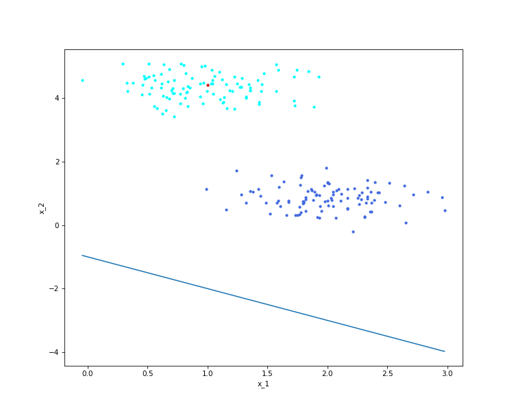

# CS460-Class-Assignments
Class Assignments for the course CS460

Assignmnet 2:
Implement Gradient Descent using 
  # Batch Gradient Descent  
  
  # Stochastic Gradient Descent  
  
  # Mini-Batch Gradient Descent  
  
  # Vanilla Perceptron  
  
